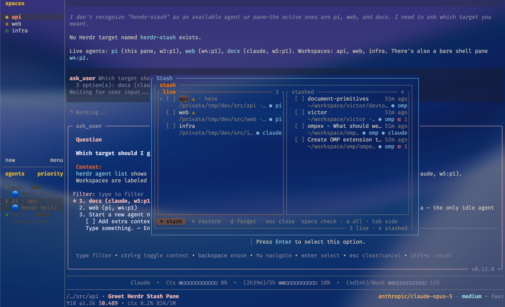

# herdr-stash

Stash a Herdr workspace: **stop** its agents, keep its shape and their
conversations, and restore it later from a clickable popup.

```bash
herdr plugin install testy-cool/herdr-stash
```

Herdr keeps every workspace it has ever held and rebuilds all of them on every
start. There are two ways out today and both are wrong for parked work: leave it
there, or close it and lose it. Upstream was
[asked for an archive section](https://github.com/ogulcancelik/herdr/issues/65)
and closed the ask — *"i can't think about a good, intuitive and easy way to
preserve archive for workspaces"* — and the
[hibernation](https://github.com/ogulcancelik/herdr/discussions/1829)
[requests](https://github.com/ogulcancelik/herdr/discussions/631) are still open
ideas. This is the middle, built on the primitives Herdr already publishes.

Stashing is not hiding. The processes stop, the RAM goes back, and nothing is
resumed on the next start — the workspace is not in Herdr's session at all.

## What it does

| Verb | What happens |
|:--|:--|
| **Stash** | Records the workspace — tabs, split tree with its ratios, each pane's directory and label, each agent's kind and conversation — then closes it, which stops every process in it. |
| **Restore** | Recreates the workspace, replays every split at its recorded ratio, resumes each agent into its own conversation, reopens plugin panes, and focuses it. |
| **Forget** | Deletes the record. The only irreversible act here, so it asks. |

Restoring **pops**: a stash that came back completely is deleted, because it is
now a duplicate of a live workspace. A restore that could not recover something
keeps its record and says what was missing.

## Using it

The picker is a popup with **two columns** — live workspaces on the left, stashed
records on the right — because the work moves both ways and a list of only stashes
can show one direction of one verb. Check rows with `space` and move them together:
left to right is stashing, right to left is restoring.



Each row is two lines: the label with its badges, and underneath the directory,
the pane count, the agents (`● pi`, `● claude`, `● omp`) and any plugin panes
(`◧ 1`). `▲` marks an agent mid-turn, `· here` the workspace the picker was opened
from, and a stashed row carries how long it has been parked.

| Key | |
|:--|:--|
| `space` | check the row · `a` checks or clears the whole column |
| `tab` `h` `l` `←` `→` | switch column |
| `j` `k` `↑` `↓` `g` `G` | move · each column keeps its own cursor |
| `↵` | move what is checked — or the row under the cursor when nothing is |
| `d` | forget the checked records (asks first) |
| `r` | re-read both sides |
| `esc` `q` | close |

Mouse-first: a click on a checkbox toggles it, a click anywhere else on a row
moves the cursor there, and the footer buttons do what the keys do. **A row click
never acts** — on the live side acting stops processes, and that should not be one
pixel away from selecting.

Row markers: `● kind` per agent, `◧ n` for panes another plugin owns, `▲` for an
agent mid-turn (a stash of that workspace is refused), `· here` for the workspace
you are standing in — which is safe to stash, because the popup outlives it.

A single restore takes you to the workspace it built; a batch does not, and puts
your focus back where it was. Stashing never moves you.

Bind it, or reach the actions from a workspace's right-click menu and from any
command palette:

```toml
[[keys.command]]
key = "prefix+s"
type = "plugin_action"
command = "vsh.stash.open"
description = "stash: the stash picker"

[[keys.command]]
key = "prefix+shift+s"
type = "plugin_action"
command = "vsh.stash.stash"
description = "stash: stop this workspace and keep it"
```

There is also a CLI, which is how the round trip is tested:

```bash
herdr-stash list
herdr-stash restore <id>
```

Records live in `$HERDR_PLUGIN_STATE_DIR/stashes`, one JSON file each, readable
and editable by hand.

## What comes back, and what does not

| Recorded | Restored |
|:--|:--|
| Tabs, split tree, every ratio | Exactly — verified against `session.snapshot`, rect for rect |
| Each pane's directory | Exactly, including panes with no agent |
| A recognised agent's conversation | Resumed with the same reference Herdr's own restart uses (`pi --session`, `claude --resume`, `omp --resume=`, `codex resume`, …); a pane-scoped handoff keeps it capturable during immediate re-stash |
| An agent parked by Herdr Hibernate | Its durable session and safe resume flags are imported directly, without waking it first |
| Panes owned by other plugins | Reopened through `plugin.pane.open` against the pane they sat beside, and swapped back if they were on the left |
| Pane labels you set | Reapplied |
| **Launch flags** (`--model`, `--dangerously-skip-permissions`) | **Best effort.** See below |
| **Anything that is not an agent** — a server, a test watcher, a REPL | **Not replayed.** The pane comes back as a shell in its directory |

▲ **Launch flags are only sometimes recoverable, and that is upstream's gap too.**
Herdr persists the conversation, not the command line, so its own restart also
resumes agents bare — see
[the request to keep them](https://github.com/ogulcancelik/herdr/discussions/632).
The live process is the only place they still exist, and
`pane.process_info` gives them up for some agents and not others: a `zsh` pane
reports its full `argv`, while a running pi reports `argv0: "pi"` and nothing
else, because pi rewrites its own process title. So flags survive where the OS
kept them, and where it did not the agent comes back with its conversation and
without its flags. Nothing is guessed.

▲ **A pane running a command is not replayed on purpose.** Herdr cannot resume an
arbitrary process either, and a command replayed blind — a migration, a deploy, a
loop with an `rm` in it — is worse than a prompt in the right directory.

## When it refuses

A stash has to be undoable. Two situations are refused, and the
*Stash: stop this workspace even mid-turn* action waives both:

- **An agent mid-turn.** Closing the workspace stops the process, and a turn
  killed halfway loses what the agent had not yet written down.
- **An agent with no recoverable conversation.** Live non-empty `agent_session`,
  a matching restore handoff, and force-free evidence are checked before Stash
  refuses. A restore handoff covers the short window before Herdr republishes
  the session.
- **A Hibernate stub without usable saved metadata.** A normal hibernated pane
  is imported directly without waking it. If state is unavailable, Stash accepts
  only the exact generated stub for that pane and its verified `exec` command;
  otherwise it refuses instead of guessing.

Everything else that cannot be captured — a layout this version cannot read, a
missing tab — aborts the stash with the workspace **untouched**. The record is
written before the close, never after.

## Notes from building it

Measured against Herdr 0.7.5-preview, because none of it is documented:

- `session.snapshot` is not in `herdr --help`. It is the one call that returns
  workspaces, tabs, panes, per-tab geometry and every pane's agent session
  together, and it is what a whole capture reads.
- The socket publishes a **flat** list of splits and pane rectangles, not the
  tree. Each split names the rectangle it divides and its ratio is the first
  child's share, so the region is the key and the tree is rebuildable. Reading
  `session.json` instead would mean mapping internal pane numbers through
  `public_pane_numbers` and depending on a persistence file Herdr rewrites behind
  the server's back.
- `pane.split`'s `ratio` is the **existing** pane's share, which is the same
  convention the layout publishes — so a recorded ratio replays unchanged.
- `agent.start` refuses a pane it has not seen a prompt in
  (`agent_pane_busy`, *is not an available shell*) for up to about a second after
  a split, and no field or event reports that state. The start is therefore its
  own readiness probe, retried until it takes.
- `pane.swap` **focuses the workspace it acts in and cannot be told not to**,
  unlike `workspace.create`, `pane.split` and `plugin.pane.open`. That is why
  restore swaps before its own final focus, and why stashing never swaps.
- Closing a workspace moves the active one even when it was not active
  ([#1328](https://github.com/ogulcancelik/herdr/discussions/1328)), so stashing
  puts your focus back where it was.
- A pane does not say which plugin owns it. Ownership is matched by the pane's
  label against the installed plugins' pane titles, which is the only thread
  back.
- An agent pane's screen cannot be read (`pane.read` returns nothing — agents run
  on the alternate screen), so the picker shows structure rather than a preview.
